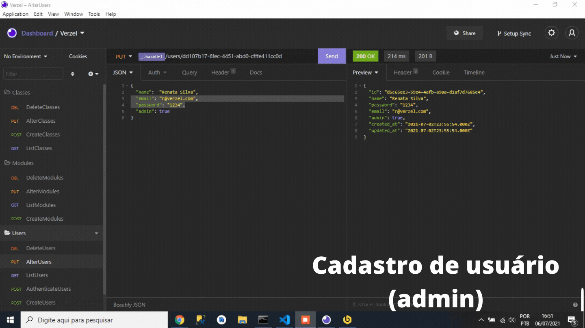

Para iniciar o projeto: 
 
### `yarn add` 
(ou yarn)
Para rodar o projeto: 
### `yarn start`

Runs the app in the development mode.\
Open [http://localhost:3000](http://localhost:3000) to view it in the browser.

Foi implementado: 
<ul>
  <li>Listagem de módulos</li>
   <li>Listagem de classes</li>
   <li>Cadastro de módulos</li>
   <li>Cadastro de classes </li>
   <li>Vínculo com back-end por meio do axios</li>
</ul>

Implementações futuras: 
<ul>
  <li>Código limpo</li>
  <li>Listagem de módulos por ordem alfabética</li>
   <li>Listagem de classes por ordem alfabética</li>
   <li>Deleção de módulos e usuários</li>
   <li>Controle de acesso</li>
   <li>Modificações das informações cadastradas (users, modules and classes)</li>
</ul>
Breve apresentação do projeto até o momento:

  

